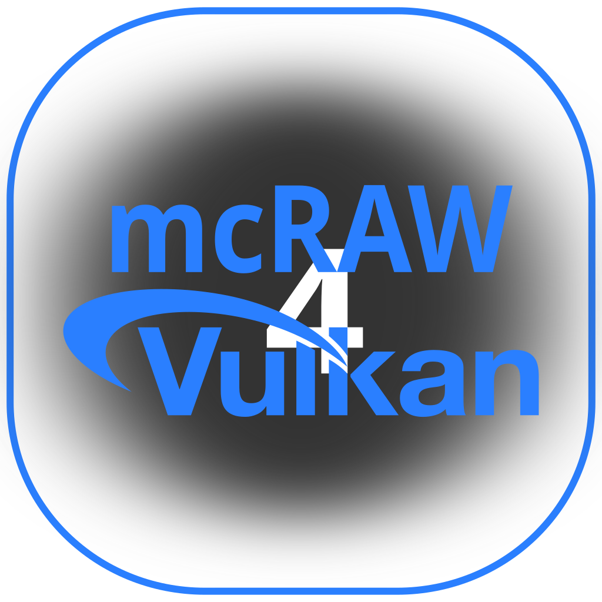
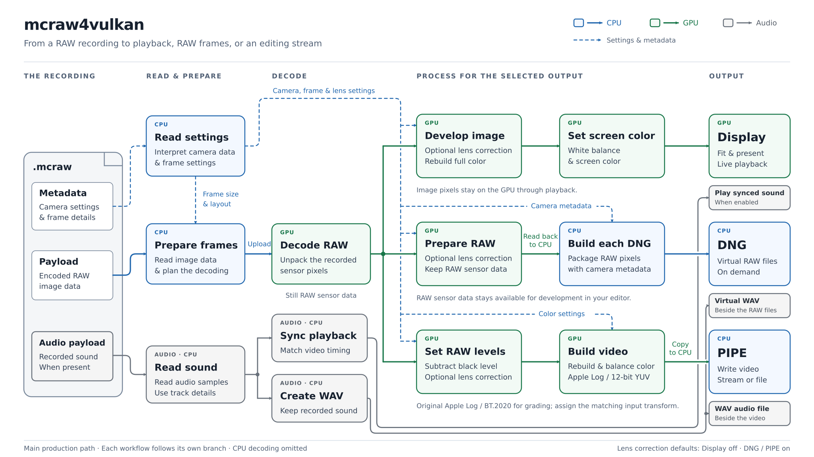

# mcraw4vulkan

mcraw4vulkan is a Rust application for displaying and processing MotionCam RAW
`.mcraw` recordings.

## Public Beta status

This source tree is Beta 0.9.1. Preserve original recordings and validate
outputs before relying on them in a production workflow. Interfaces and package
details may change as Beta feedback is incorporated.

## What mcraw4vulkan does

The primary production path decodes MotionCam RAW video through wgpu's Vulkan
backend. The command-line interface can display clips, mount virtual DNG files,
write PIPE raw-video output, and run the optimizer. A graphical interface built
with SDL2, wgpu, and egui provides Quick Preview, Display, PIPE, DNG, and
optimizer workflows.

## Main features

- Vulkan/wgpu accelerated `.mcraw` decoding, with a CPU parity path available
  as an explicit manual fallback.
- CLI and GUI applications.
- Quick Preview and full decoded Display playback.
- Direct planar `yuv444p12le` PIPE output with TV range, BT.2020 primaries,
  AppleLog transfer, BT.2020 NCL matrix coefficients, and no alpha channel.
  Supported input audio is extracted through the
  existing WAV sidecar path.
- Virtual DNG mounting with the platform's native filesystem adapter.
- Audio playback and virtual audio files where the input and platform support
  them.
- An optimizer that selects between the two supported production payload
  profiles.

## Supported operating systems

- Linux uses FUSE3 for virtual DNG mounts.
- macOS uses macFUSE for virtual DNG mounts. GPU work follows the
  MoltenVK-compatible Vulkan path.
- Windows uses Projected File System (ProjFS) for virtual DNG mounts.

The adapters share the virtual-filesystem model, but native mount lifecycle and
runtime requirements differ by operating system.



## Runtime requirements

The production decode path requires a working Vulkan loader and driver. SDL2 is
required for the graphical application, display windows, and supported audio
playback. DNG mounting additionally requires FUSE3 on Linux, macFUSE on macOS,
or ProjFS on Windows.

The preflight checker reports the platform capabilities needed by the GUI.
Package-specific runtime details are documented under `packaging/`.

## Installation

Build the three release executables from this source tree as described below,
or install them through a platform package that includes `LICENSE`,
`THIRD_PARTY_NOTICES.md`, and its bundled-component license files. Keep
`mcraw4vulkan`, `mcraw4vulkan-gui`, and
`mcraw4vulkan-preflight-check` together so the GUI can resolve its companion
processes.

## Quick start

Display a clip with the default GPU path:

```sh
mcraw4vulkan display FILE.mcraw
```

Launch the graphical interface through the preflight checker:

```sh
mcraw4vulkan-preflight-check --gui mcraw4vulkan-gui
```

Write the direct-YUV byte stream and version-4 metadata beside an output file:

```sh
mcraw4vulkan pipe --output clip.yuv444p12le FILE.mcraw
```

`--output` applies the shared Apple Log filename stem; shell redirection uses
the filename chosen by the shell.

PIPE always encodes **original Apple Log / BT.2020 D65 / BT.2020 NCL / TV
range**, with 12 meaningful bits in little-endian 16-bit planar Y/Cb/Cr lanes
(4:4:4, six storage bytes per pixel). It is an editing encoding, not a
display-ready image. Manually assign **Rec.2020** and **AppleLog** in the editor. Do not select Apple Log 2 or Apple Wide Gamut.


The GUI Pipe Example feeds already encoded pixels to FFmpeg. Linux/Windows
use Vulkan ProRes 4444 profile 4; macOS uses VideoToolbox after
 a required conversion to `p410le` (ten meaningful bits in 16-bit storage). ProRes is lossy.
The examples set `-color_primaries bt2020 -colorspace bt2020nc -color_range tv
-color_trc 2 -movflags +write_colr`. Transfer tag 2 is deliberately unspecified:
it does not automatically identify Apple Log. Neither the sidecar nor the
filename guarantees automatic editor recognition.

Version 0.9.1 replaces the previous half-scale linear transfer function. Sidecars use
`metadata_version=4` and algorithm
`mcraw-yuv444p12le-tv-bt2020-apple-log-original-ncl-v1`; video, JSON and audio
names share `-BT2020-AppleLog-original-tv`. Display, RAW decoding and
camera-domain DNG remain unchanged; Apple Log assignment is only for PIPE YUV444 video,
not DNG files.

### PIPE numerical contract

Signed linear correction, demosaic and camera-to-BT.2020 conversion occur
before the component transfer, without the former final half-signal scale.
For each finite BT.2020 component `x`, original Apple Log is:

```text
R0=-0.05641088; Rt=0.01; c=47.28711236
beta=0.00964052; gamma=0.08550479; delta=0.69336945
F(x) = 0                                  x < R0
       c*(x-R0)^2                         R0 <= x < Rt
       gamma*log2(x+beta)+delta            x >= Rt
```

Physical zero encodes near 0.15047645 (neutral Y=783), middle gray `x=0.18`
near 0.48827246 (Y=1967), and `x=5.76` near 0.90956672 (Y=3443).
The physical gray target in a recording is not automatically normalized to
0.18. Components below R0 collapse to R0 after inversion; finite upper
excursions are retained until terminal packing. NaN, infinity and arithmetic
overflow fail the frame. Apple Log and integer packing are not lossless, and
shadow code spacing is not constant throughout the toe.

For transferred components `R',G',B'`, `Y'=0.2627R'+0.6780G'+0.0593B'`,
`Cb=(B'-Y')/1.8814`, `Cr=(R'-Y')/1.4746`. Map Y with `256+3504Y'` and chroma
with `2048+3584C`. Clamp each plane to 16..4079, then round with
`floor(value+0.5)`; no dithering. Nominal Y is 256..3760 and nominal chroma
256..3840, centered at 2048. Colored components may saturate a chroma plane
before neutral luma reaches its limit.

To reconstruct, remove the limited-range offsets/scales, invert BT.2020 NCL,
then apply the original component inverse. With `Pt=c*(Rt-R0)^2`:

```text
G(v) = R0                                 v < 0
       sqrt(v/c)+R0                       0 <= v < Pt
       exp2((v-delta)/gamma)-beta          v >= Pt
```

Do not subtract F(0), add one stop, or insert an ACES gamut conversion.
The sidecar records the constants, domain, packing and reconstruction order.
The reference and its revision are attributed in `NOTICE`.

Run `mcraw4vulkan --help` for the complete current command syntax.

## DNG mounting

Mount one clip as a virtual DNG and audio directory:

```sh
mcraw4vulkan dng FILE.mcraw
```

The command serves a foreground, per-clip mount under the mcraw4vulkan folder
in the user's home or profile directory. Press Ctrl-C to stop it. Unmount one
clip with `mcraw4vulkan dng unmount FILE.mcraw`, or use
`mcraw4vulkan dng unmount all` for mcraw4vulkan-owned mounts.

The macFUSE VFS supports a maximum of 64 simultaneous mounts system-wide.
Other macFUSE volumes consume the same mount slots; this is not an
mcraw4vulkan memory limit.

## Optimizer

The optimizer compares the complete `default_chunked64` and `offset_prefetch`
payload profiles using Display and PIPE measurements, applies the production
no-loss and throughput policy, and stores only the selected payload profile.

```sh
mcraw4vulkan optimizer FILE.mcraw
```

Restore the default selection with `mcraw4vulkan optimizer
--restore-defaults`.

## Build from source

The workspace declares Rust 1.87 as its minimum supported Rust version and
selects the stable toolchain with rustfmt and Clippy. Install the native SDL2,
Vulkan, and mount-backend development files required by your operating system,
then run:

```sh
cargo build --workspace --release --locked
```

The user-facing executables are written to `target/release/`. Validate the
workspace with:

```sh
cargo test --workspace --locked
```

These commands build the current checked-out source. Ordinary source edits do
not require regenerating or resealing a distribution manifest, and
`cargo build --release` is also the normal optimized build used for direct
testing.

Platform distribution packages are assembled by the maintainer's native-host
packagers from this public source. Those convenience tools and their selected
SDK, signing, and output settings are not part of the public application
source. See `packaging/macos/README.txt` for macOS source-build and runtime
requirements.

## Beta limitations

- Decoder support is limited to the container and payload encodings implemented
  by this Beta; compatibility with every `.mcraw` recording is not guaranteed.
- The CPU decoder is a parity/manual fallback, not the optimizer-selected
  production default.
- Mount behavior and cleanup details differ across FUSE3, macFUSE, and ProjFS.
- A working platform Vulkan stack is required for the primary decode path.
- Native package installation and first-launch approval behavior depends on the
  operating system and package format.

## macOS signing status

Signing and notarization are properties of a particular packaged artifact.
Consult the metadata shipped with that artifact; macOS may require explicit
user approval before the first launch.

## Reporting bugs and support

Report reproducible problems through
[GitHub Issues](https://github.com/nate808-gh/mcraw4vulkan/issues). Include the
operating system, command or GUI workflow, and non-sensitive diagnostic output.

## License

Copyright (C) 2026 nate808-gh

mcraw4vulkan is free software: you can redistribute it and/or modify it under
the terms of the GNU General Public License as published by the Free Software
Foundation, either version 3 of the License, or (at your option) any later
version (`GPL-3.0-or-later`). See `LICENSE`.

Third-party components retain their upstream licenses. See
`THIRD_PARTY_NOTICES.md` and `licenses/`.
